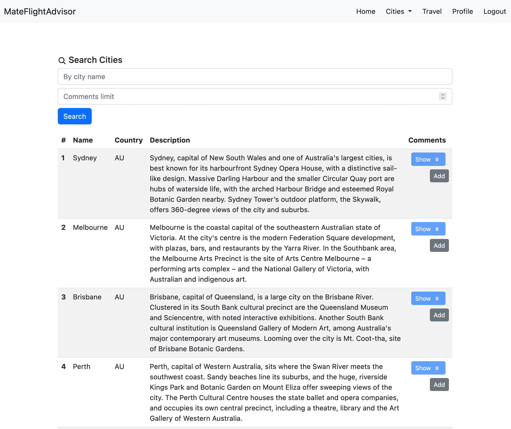
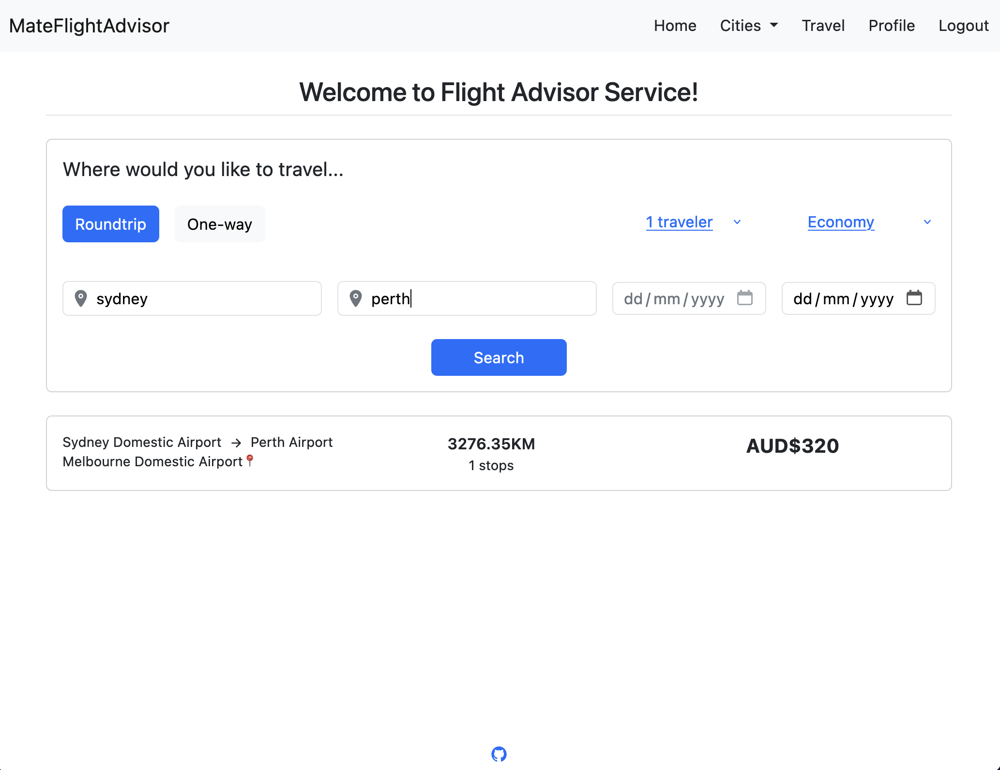
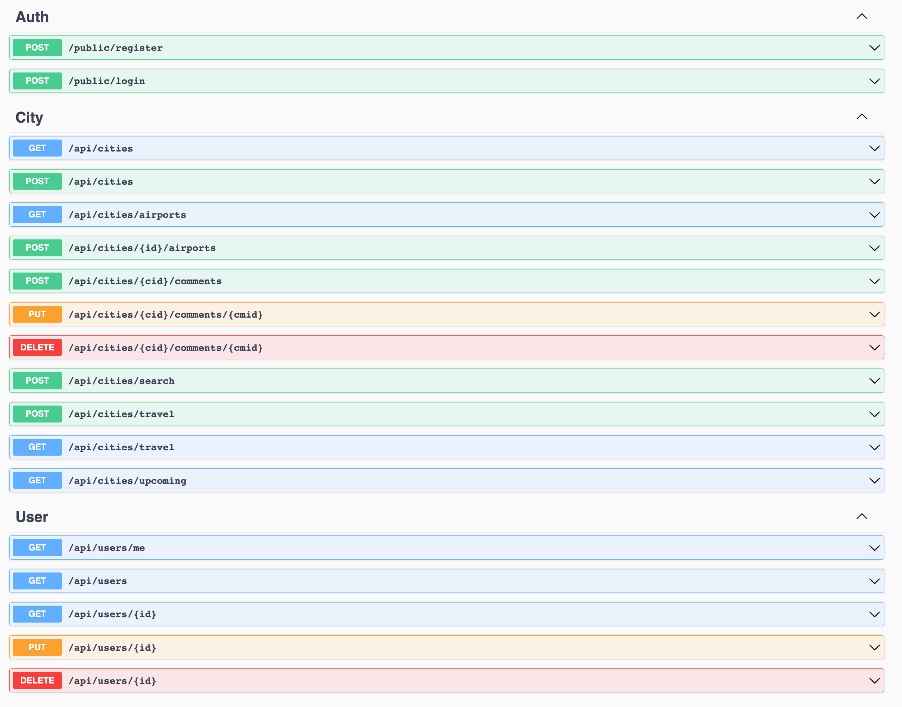

## Mate Flight Advisor

A travel app that helps users search and compare flights to find the best deals for their trips in Australia. The app allows users to enter their travel destination and dates, and then display a range of flight options from various airlines.

-   Tech Stack: Angular, .NET Core, SignalR, MongoDB, Docker

Website: https://mate-flight-advisor.vercel.app

| Codebase                                                                              | Description                  |
| ------------------------------------------------------------------------------------- | ---------------------------- |
| [mateflightadvisor-app](https://github.com/kkaung/MateFlightAdvisor/tree/main/client) | Angular Frontend Application |
| [mateflightadvisor-api](https://github.com/kkaung/MateFlightAdvisor/tree/main/server) | .NET Core Server             |

## App Previews

-   Cities Page

-   Travel Page

-   Api Endpoints

